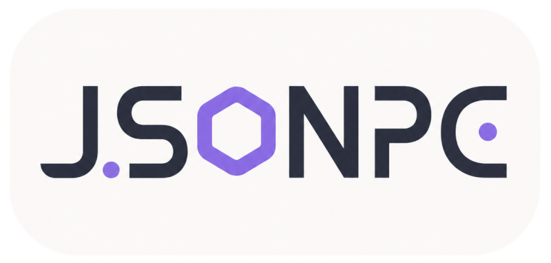

<div align="center">




**JSON with Property Comments** — A lightweight JSON variant that allows single-line comments `//` and trailing commas in JSON files.
  
[](https://www.npmjs.com/package/jsonpc-ts) [](https://npmcharts.com/compare/jsonpc-ts,token-types?start=1200&interval=30)
[](https://opensource.org/licenses/MIT) [](https://www.codacy.com/app/Borewit/jsonpc-ts?utm_source=github.com&utm_medium=referral&utm_content=Borewit/jsonpc-ts&utm_campaign=Badge_Grade)

</div>


## Syntax

**jsonpc** follows these rules for comment:

1. Trailing commas in arrays and objects are allowed
2. Only single-line comments starting with `//` are supported
3. Comments must occupy an entire line
4. Multiple consecutive comment lines are allowed
5. Valid comment positions:
   1. Top of the file (before any JSON content)
   2. Bottom of the file (after all JSON content)
   3. Above property names

_Other positions and block comments are not allowed._

### Examples

```jsonc
// ✅ Valid: Top-level file comment
// ✅ Valid: Multiple consecutive comments allowed
{
  // ✅ Valid: Comment above property name
  "name": "Alice",

  // ✅ Valid: Comment above array element (primitive)
  "items": [
    // ❌ Invalid: Comment not above a property
    1,
    2,
  ],

  "users": [
    {
    // ✅ Valid: Comment above object property in array
    // ✅ Valid: 1 Multiple consecutive comments allowed
    // ✅ Valid: 2 Multiple consecutive comments allowed
      "name": "Bob"
    },
    // ❌ Invalid: Comment not above a property
    "sdaf"
  ],

  /* ❌ Invalid: Block comments not supported */
  "key": "value",
  // ❌ Invalid: Comment not above a property
}
// ✅ Valid: Bottom-level file comment
```

### Read and set values and comments

```ts
import { parse } from 'jsonpc-ts';

const jsonpc = parse(text);

// Get both value and comments for a property path
const entry = jsonpc.get('profile');
// → { value: { age: 25 }, comments: ['// Nested object comment'] }

// Get value only
const name = jsonpc.get('name')?.value;    // → "Alice"
const age = jsonpc.get('profile.age')?.value; // → 25
const age = jsonpc.get(['profile','age'])?.value; // → 25

// Get comments only
const comments = jsonpc.get('name')?.comments;
// → ['This is a name comment']

// Set value only
jsonpc.set('profile.age', { value: 26 });

// Set comments only
jsonpc.set('name', { comments: ['Updated name comment'] });

// Set both value and comments
jsonpc.set('profile', {
  value: { age: 26 },
  comments: ['Updated profile comment']
});

// Handle non-existent paths
const entry = jsonpc.get('nonexistent');
// → undefined
```

### Array operations

```ts
// All common array methods supported, comments automatically maintained
jsonpc.updateArray('items', 'push', [4]);           // Add element
jsonpc.updateArray('items', 'pop', []);             // Remove last
jsonpc.updateArray('items', 'shift', []);           // Remove first
jsonpc.updateArray('items', 'unshift', [0]);        // Add to beginning
jsonpc.updateArray('items', 'splice', [1, 2, 5, 6]); // Replace elements
jsonpc.updateArray('items', 'sort', [(a, b) => a - b]); // Sort
jsonpc.updateArray('items', 'reverse', []);         // Reverse
```

### Top and Bottom Comments

```ts
// Get top-level file comments
const topComments = jsonpc.top;


// Get bottom-level file comments  
const bottomComments = jsonpc.bottom;

// Set top-level comments
jsonpc.top = ['New top comment'];

// Set bottom-level comments
jsonpc.bottom = ['New bottom comment'];
```

### Serialization

```ts
// Serialize back to JSON text with comments
const output = jsonpc.stringify();

// Custom indentation and replacer
const custom = jsonpc.stringify(null, 4);

// Or use the standalone stringify function
const output = stringify(jsonpc);

// Get clean JSON object without comments
const clean = jsonpc.toObject();
```


### `class JSONPC`

#### Properties

| Property | Type       | Description                        |
| -------- | ---------- | ---------------------------------- |
| `top`    | `string[]` | Get/set top-level file comments    |
| `bottom` | `string[]` | Get/set bottom-level file comments |

#### Methods

| Method                                                       | Description                                   |
| ------------------------------------------------------------ | --------------------------------------------- |
| `get(path: string \| string[]): Entry \| undefined`          | Get entry with value and comments             |
| `set(path: string \| string[], entry: Partial<Entry>): this` | Set value and/or comments                     |
| `updateArray(path, method, args): this`                      | Execute array operations                      |
| `stringify(replacer?, space?): string`                       | Serialize to JSON text with comments          |
| `toObject<T>(): T`                                           | Return a pure JavaScript object (no comments) |
| `destroy(): void`                                            | Clean up internal references                  |

#### Type Definitions

```typescript
interface Entry {
  value: any;
  comments?: string[];
}
```

#### Property Path Format

Use dot-separated path strings or string arrays:

```ts
"objectName"          // Top-level property
"nested.prop"         // Nested property
"items.0"             // Array element
"users.1.name"        // Object property in nested array

// Or use array syntax
['users', 1, 'name']  // Same as above
```

#### Supported Array Methods

The `updateArray` method supports these array operations:

- `push` — Add elements to the end
- `pop` — Remove the last element
- `shift` — Remove the first element
- `unshift` — Add elements to the beginning
- `splice` — Insert/delete/replace elements
- `sort` — Sort the array
- `reverse` — Reverse the array

## Comparison with Alternatives

| Solution   | Custom Parser | Arbitrary Position Comments | Trailing Commas | Size   |
| ---------- | ------------- | --------------------------- | --------------- | ------ |
| **jsonpc** | ❌            | ❌                          | ✅              | Small  |
| json5      | ✅            | ✅                          | ✅              | Large  |
| JSONC      | ✅            | ✅                          | ❌              | Medium |

jsonpc trades some flexibility for simplicity and performance.

## License

[MIT](LICENSE)

## Contributing

Issues and Pull Requests are welcome!

## Related Links

- [GitHub Repository](https://github.com/baendlorel/jsonpc)
- [npm Package](https://www.npmjs.org/package/jsonpc-ts)
